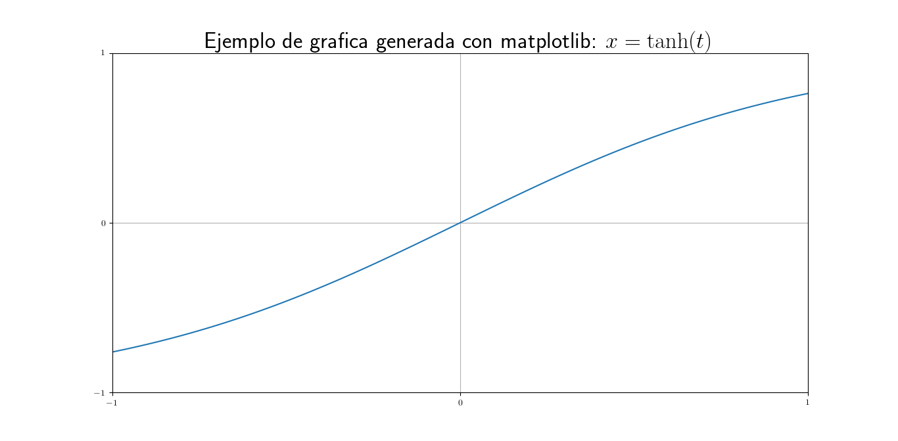

Acerca de este fichero, MARKDOWN.md, y del lenguaje en que está escrito, Markdown
==================================================================================

MARKDOWN.md es un fichero de texto escrito con un formato denominado _**Markdown**_. La principal
característica de este formato es que, manteniendo la legibilidad cuando se visualiza con herramientas en
modo texto (`more`, `less`, editores varios, ...), permite amplias posibilidades de visualización con
formato en una amplia gama de aplicaciones; muy notablemente, **GitHub**, **Doxygen** y **Facebook**
(ciertamente, :eyes:).

Encabezados y marcadores de sección
-----------------------------------

Una de las principales características de Markdown es su capacidad de estructurar el texto con títulos de
sección en seis niveles distintos:

# Una almohadilla implica un título de primer nivel

Aunque también se puede subrayar con un mínimo de 3 signos =
============================================================

## Dos almohadillas implica un título de segundo nivel

Que también se puede marcar con un mínimo de 3 signos -
-------------------------------------------------------

### Para el resto de niveles, sólo se pueden utilizar almohadillas

###### Hasta un total de 6 almohadillas, para títulos de sexto nivel

Tablas y realce del texto (cursiva y/o negrita)
-----------------------------------------------

Markdown permite construir tablas como la siguiente, que muestra distintas opciones de realce del texto:

modo texto               |modo gráfico           |modo texto                |modo gráfico
-------------------------| :-------------------: |--------------------------| :--------------------:
`*cursiva*`              |*cursiva*              |`_cursiva_`               |_cursiva_
`**negrita**`            |**negrita**            |`__negrita__`             |__negrita__
`***cursiva y negrita***`|***cursiva y negrita***|`___negrita y cursiva___` |___negrita y cursiva___
`_**negrita y cursiva**_`|__*negrita y cursiva*__|`__*cursiva y negrita*__ `|_**cursiva y negrita**_

- NOTA: **Doxygen** no muestra correctamente el texto con formato de la tabla anterior. Sin embargo, otros
  programas, en particular, **GitHub**, sí lo hacen.

Enlaces a páginas web
---------------------

También permite los links, como el siguiente, que permite acceder a los elementos más importantes de la 
sintaxis de este formato desde la página de su creador, _John Gruber_:
[Sintaxis de Markdown](https://daringfireball.net/projects/markdown/syntax).

Inclusión de gráficas
---------------------

Pueden incluirse gráficas, que deben estar en la misma estructura de directorios del repositorio:



Esquemas y listas anidadas
--------------------------

1. Este es el primer ítem de una lista numérica
1. Este es el segundo
   - Este es un punto del segundo ítem
   - Este es otro
1. Este es el tercer ítem (pero da igual qué ponga, mientras sea un número)
    1. Ahora uso otra ordenación numérica
    1. Y la sigo usando
       - Hay distintos tipos de _bullets_
       - Pero tampoco tantos
    1. Puedo recuperar el nivel de esquema anterior

   Puede parecer que me olvido de la lista, porque este párrafo está fuera los ítems.

1. Pero, si mantengo el sangrado, el esquema continúa

<!-- -->

1. Para empezar un esquema nuevo puedo meter un comentario HTML `<!-- -->`
    1. El comentario no se ve al interpretar el markdown, pero hace su trabajo

Código fuente con realce de sintaxis en distintos lenguajes
-----------------------------------------------------------

El código fuente puede insertarse en la misma línea (`for (i = 0; i < N; i++) {`) o en bloques de
código, en cuyo caso podemos especificar el lenguaje para realzar la sintaxis:

```c
for (i = 0; i < N; i++) {
    fprintf(stdout, "%d\n", i);
}
```

```bash
for i in 1 2 3 4; do
    echo $i
done
```

_Aromas_ de Markdown
--------------------

Algunas aplicaciones añaden ampliaciones específicas al lenguaje, los llamados _flavours_ (aromas). Esto
es, a la vez, una ventaja y un inconveniente, ya que, aunque muchas de ellas son realmente útiles, rompen
la unidad del lenguaje e introducen incompatibilidades. Ahora bien, como todos ellos mantienen como
referencia la legibilidad del fichero original en modo texto, las incompatibilidades no suelen traducirse
en situaciones demasiado desastrosas. Entre los flavours más importantes para nosotros cabe destacar el
[Markdown de GitHub](https://guides.github.com/features/mastering-markdown/) o el
[Markdown de Doxygen](http://www.doxygen.nl/manual/markdown.html).
